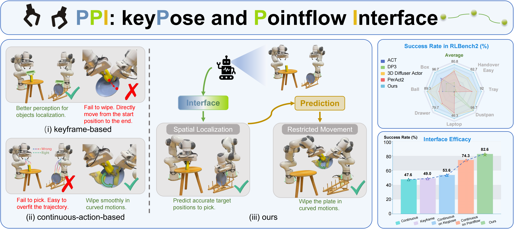
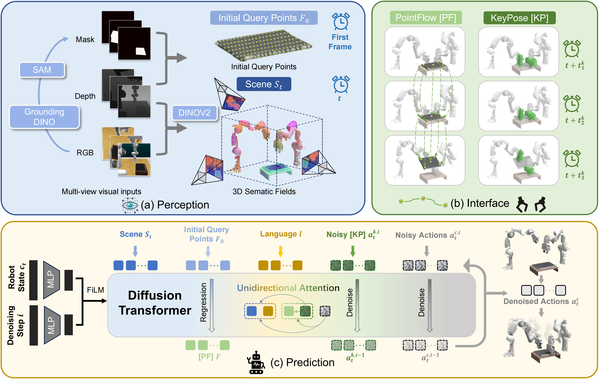

<div align="center">   
  
# Gripper Keypose and Object Pointflow as Interfaces for Bimanual Robotic Manipulation


  <a href="https://arxiv.org/abs/2504.17784">Arxiv</a> |
  <a href="https://yuyinyang3y.github.io/PPI/">Webpage</a>

<a href="https://github.com/yuyinyang3y">Yuyin Yang*</a>, 
<a href="https://github.com/healorcai">Zetao Cai*</a>, 
<a href="https://github.com/Nimolty?tab=overview&from=2024-01-01&to=2024-01-31">Yang Tian</a>, 
<a href="https://scholar.google.com/citations?user=kYrUfMoAAAAJ&hl=zh-CN">Jia Zeng</a>, 
<a href="https://oceanpang.github.io/">Jiangmiao Pang</a>

**Robotics: Science and Systems (RSS) 2025**
</div>

## 🍀  Overview <a name="overview"></a>
🦾 **PPI** integrates the prediction of **target gripper poses** and **object pointflow** with the continuous actions estimation, providing enhanced spatial localization and satisfying flexibility in handling movement restrictions.


<!-- Existing approaches for bimanual manipulation fall into two categories: keyframe-based strategies and continuous control methods. The former struggles to perform consistently or execute curved motions, while the continuous method suffers from weaker spatial perception.
To address these issues, **PPI** integrates the prediction of target gripper poses and object pointflow with the continuous actions estimation, providing enhanced spatial localization and satisfying flexibility in handling movement restrictions. -->

<table class="center">
<tr>
  <td><video src="https://github.com/user-attachments/assets/9ffbdadd-ddc0-475d-8bd6-a024e1a5a85a" autoplay></td>
  <td><video src="https://github.com/user-attachments/assets/e0566a29-d17e-4614-b8fc-80f5f9f8b31b" autoplay></td>
</tr>
<tr>
  <td><video src="https://github.com/user-attachments/assets/74388154-cef1-4c61-9848-653f8fc95803" autoplay></td>
  <td><video src="https://github.com/user-attachments/assets/da4f1fa9-c5fa-4382-87fe-2b433edc917f" autoplay></td>
</tr>
</table>


<!-- **PPI** integrates the prediction of target gripper poses and object pointflow with the continuous actions estimation, providing enhanced spatial localization and satisfying flexibility in handling movement restrictions. -->

## :books: Table of Contents:
1. [Highlights](#high)
2. [Simulation](#start)
    - [Data Preparation](#data)
    - [Training](#training)
    - [Evaluation](#evaluation)
3. [Real-World](#real-world)
4. [TODO List](#todos)
5. [License](#license)
6. [Citation](#citation)
7. [Acknowledgment](#acknowledgment)

## ✨ Highlights <a name="high"></a>


- 🏆 **State-of-the-Art Performance**: PPI achieves superior results on bimanual manipulation benchmark RLBench2.
- 🔧 **Real-World Robustness**: Demonstrates remarkable real-world generalization, mastering unseen objects, dynamic lighting, messy backgrounds, and object interference like a natural.
- 🧠 **Novel Interface Design**: Combines gripper keyposes and object pointflow for bimanual robotics manipulation.

## :computer: Simulation Experiments <a name="start"></a>
We provide step-by-step guidance for running PPI on RLBench2 benchmark. Follow the specific instructions for a seamless setup.

### Step 1: Data Preparation <a name="data"></a>

We evaluate PPI on seven RLBench2 benchmark tasks. Our regenerated dataset addresses limitations in the original:
- Fixed train-test misalignment (e.g., inconsistent robot shadows)
- Added missing object pose metadata

**Dataset Options**:
- Download [Preprocessed Dataset](https://github.com/OpenRobotLab/PPI) (Coming soon!) (recommended).
- Generate custom data following our [Data Processing Guide](docs/DATA_PREPROCESSION.md). Our regenerated dataset(with object pose metadata) is available [here](https://huggingface.co/datasets/yuyinyang3y/Open-PPI).


### Step 2: Training <a name="training"></a>

#### 1. Environment Setup
Follow our [Installation Guide](docs/INSTALLATION.md) for dependencies and environment configuration.

#### 2. Running Experiments  
(1) **Main Training Pipeline**:

Please check training scripts in `scripts/training` and modify the path and wandb keys.

```bash
bash scripts/training/ddp_train_ball.sh
```
Checkpoints are saved to `exp_logs/ckpt` by default. To customize the path, modify `ppi/config/ppi.yaml`.

To resume training from the latest checkpoint, set `training.resume=true` in the training scripts.

Please refer to the source code to modify other hyperparameters in the configuration.

For more training details, see [Training Details](docs/TRAINING_DETAIL.md).


(2) **Ablation Study**:

We include the code for ablation tests in the paper, which compared PPI with the vanilla keyframe and continuous baselines and settings of predicting continuous actions conditioning on separate interfaces.

Example scripts for the `bimanual_push_box` task are available in `scripts/ablation/`. To adapt to other tasks, modify these key configurations:

```bash
# for example: predicting continuous actions conditioned on keyposes
torchrun --nnodes 1 --nproc_per_node $ngpus --master_port 10004 ddp_train.py \
  ...
  n_action_steps=54 \
  ...
  policy.what_condition='keyframe_continuous' \
  policy.predict_point_flow=false \
  ...
  task.dataset.prediction_type='keyframe_continuous' \
  horizon_keyframe=4  \
  horizon_continuous=50 \
```

### Step 3: Evaluation <a name="evaluation"></a>

#### Checkpoints
Relevant checkpoints are available [here](https://huggingface.co/datasets/yuyinyang3y/Open-PPI/tree/main/ckpt).


#### Inference on RLBench2
See [Inference Guide](docs/INFERENCE.md).


## 🤖 Real-World Deployment <a name="real-world"></a>
See [Real-World](docs/REALWORLD.md).


## 📆 TODO <a name="todos"></a>
- [x] Release the training code of simple-PPI and realworld deployment.
- [ ] Release the pre-generated datasets and data generation code.
- [x] Release the checkpoints.
- [x] Release the evaluation code of PPI on RLBench2 experiment.

## License <a name="license"></a>

All assets and code are under the [Apache 2.0 license](./LICENSE) unless specified otherwise.

## Citation <a name="citation"></a>
If you find the project helpful for your research, please consider citing our paper:
```bibtex
@article{yang2025gripper,
  title={Gripper Keypose and Object Pointflow as Interfaces for Bimanual Robotic Manipulation},
  author={Yang, Yuyin and Cai, Zetao and Tian, Yang and Zeng, Jia and Pang, Jiangmiao},
  journal={arXiv preprint arXiv:2504.17784},
  year={2025}
}    
```

## Acknowledgment <a name="acknowledgment"></a>
This project builds upon [DP3](https://github.com/YanjieZe/3D-Diffusion-Policy), [3D Diffuser Actor](https://github.com/nickgkan/3d_diffuser_actor) and [GenDP](https://github.com/WangYixuan12/gendp). We thank these teams for their open-source contributions.
